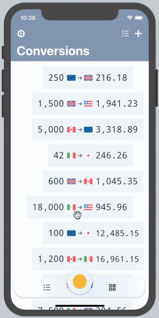

# FloatingTabBarController

[](https://cocoapods.org/pods/FloatingTabBarController)
[](https://cocoapods.org/pods/FloatingTabBarController)
[](https://cocoapods.org/pods/FloatingTabBarController)



`FloatingTabBarController` is a tab bar controller with sliding tabs and a custom tab bar inspired by [this Dribbble shot](https://dribbble.com/shots/4844696-Tab-bar-interaction-with-animated-icons).

## Example

To run the example project, clone the repo, and run `pod install` from the Example directory first.

## Requirements

`FloatingTabBarController` requires at least iOS 11.0

## Installation

`FloatingTabBarController` is available through [CocoaPods](https://cocoapods.org). To install
it, simply add the following line to your Podfile:

```ruby
pod 'FloatingTabBarController'
```

## Usage

Create a new instance of `FloatingTabBarController` and set the `viewControllers` property. The tab bar will be populated using the `floatingTabItem` property of `UIViewController`, which you should set.

You can create a `FloatingTabItem` with one or two images, it is recommended that selected images are slightly larger (35x35pt) than normal images (25x25pt). When initialized with a single image, that image will be used for both states.

You can customize the tab bar's background color and visual effect, as well as its tint color, which will reflect on the color of the icons if the images are set to render as template.

## Author

EmilioPelaez, me@epelaez.net

## License

FloatingTabBarController is available under the MIT license. See the LICENSE file for more info.
